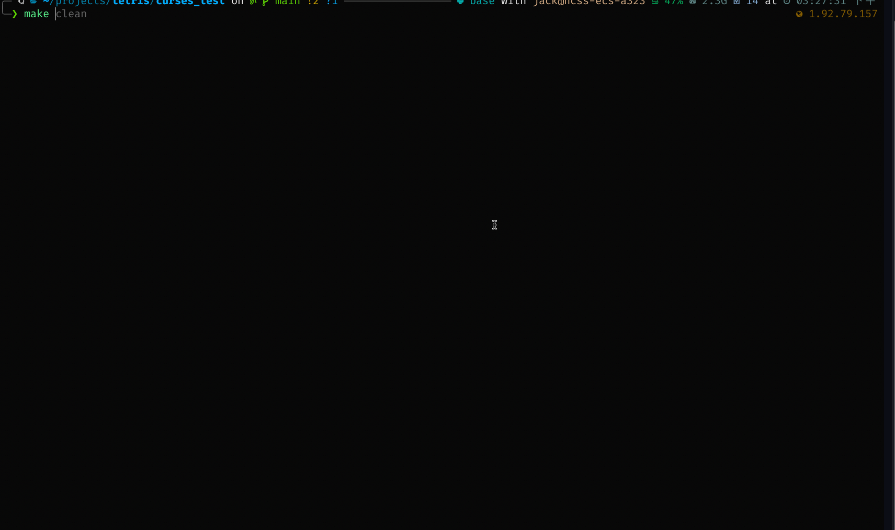
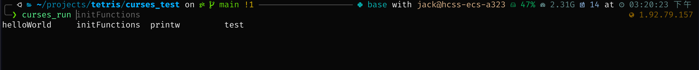

# ncurses
Codes for learning ncurses


## Usage

### A. Build

A `Makefile` has been configured to build all exectuabls. By default, all exectuables will be output to `bin` directory.

Run the following command to build all exectuables.

```bash
make all
```

To clean them, run the following command.
```bash
make clean
```

### B. Run

A shell script `curses_run` has been developed to ease running exectuables. 

Run the following command to enable it:
```bash
source curses_run
```

Then, you may start to use `curses_run` to run exectuables:
```bash
curses_run <Tab>
```
